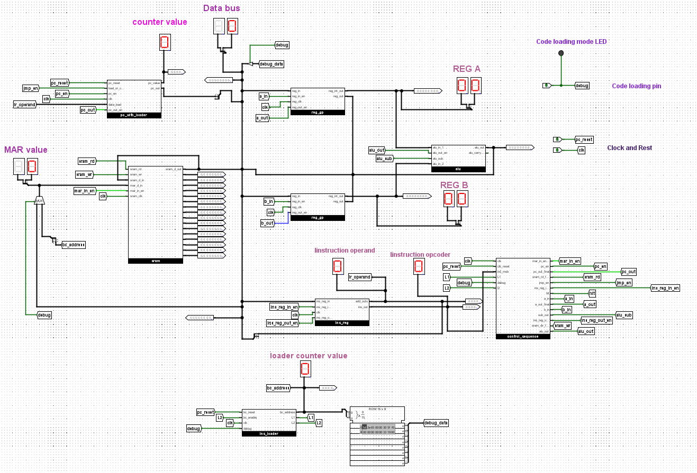

# SAP-1-Architecture-Logisim
## Table of Contents
Click on the Table of Contents below to directly go to the sections:

- [Project Overview](#project-overview)
- [Objectives](#objectives)
- [Key Features](#key-features)

- [Architecture and Functional Block Analysis](#architecture-and-functional-block-analysis)
  - [System Architecture Overview](#system-architecture-overview)
  - [Register Implementation (A, B)](#register-implementation-a-b)
  - [Program Counter (PC) Implementation](#program-counter-pc-implementation)
  - [Memory System and Address Register](#memory-system-and-address-register)
  - [Instruction Register and Opcode Decoder](#instruction-register-and-opcode-decoder)
  - [Arithmetic Logic Unit (ALU) Implementation](#arithmetic-logic-unit-alu-implementation)
  - [Boot/Loader Counter and Phase Generation](#bootloader-counter-and-phase-generation)

- [Control System Design](#control-system-design)
  - [Timing Control Generator](#timing-control-generator)
  - [Automatic Operation Control Logic](#automatic-operation-control-logic)
  - [Manual/Loader Operation Control](#manualloader-operation-control)

- [Instruction Set Architecture](#instruction-set-architecture)
  - [Instruction Encoding Scheme](#instruction-encoding-scheme)
  - [Assembler](#assembler)

- [Operation](#operation)
  - [Fetch–Decode–Execute Cycle](#fetchdecodeexecute-cycle)
  - [Running the CPU in Manual Mode](#running-the-cpu-in-manual-mode)
  - [Running the CPU in Automatic Mode (JMP + ADD Program)](#running-the-cpu-in-automatic-mode-jmp--add-program)

- [Future Improvement](#future-improvement)
- [Conclusion](#conclusion)

## Project Overview

This project implements an **enhanced 8-bit SAP-1 computer** in **Logisim Evolution** with **hardwired control** and an extended instruction set (`LDA`, `LDB`, `ADD`, `SUB`, `STA`, `JMP`, `HLT`).  
It supports **Automatic Mode** (fetch–decode–execute cycle) and **Manual/Loader Mode** for program transfer.  
A **control sequencer** manages the bus and timing, while a **web-based assembler** converts assembly code into Logisim-compatible images.  
Test programs verified correct instruction execution and memory operations, making it a **reliable educational framework** for learning processor architecture.

## Objectives

- Develop an improved **SAP-1 (8-bit)** computer in **Logisim Evolution** for teaching and system-level analysis.  
- Implement a classical **single-bus architecture** with **8-bit data path**, **4-bit address space (16 bytes)**, and a **hardwired control sequencer** managing the fetch–decode–execute cycle.  
- Support **Automatic Mode** (six-stage ring counter `T1–T6` with opcode decoder) and **Manual/Loader Mode** for safe program loading into RAM.  
- Design a datapath with **dual 8-bit registers** (A and B), **ripple-carry ALU** (`ADD/SUB`), **4-bit program counter** (increment/load), **Memory Address Register (MAR)**, **16×8 SRAM**, and **Instruction Register** (opcode + operand) while enforcing **strict single-driver bus operation**.

## Key Features

- **8-bit CPU Architecture:** Implements the classic SAP-1 design with 8-bit data and address buses.  
- **Manual & Automatic Modes:** Allows step-by-step instruction execution and fully automatic program run.  
- **Register Set:** Includes **A and B registers** for ALU operations and temporary storage.  
- **Program Counter (PC):** Automatically increments to fetch the next instruction from memory.  
- **Memory System:** Combines **ROM for program storage** and an **Address Register** for accessing memory.  
- **Instruction Register & Opcode Decoder:** Separates instructions into opcode and operand for proper ALU operations.  
- **Arithmetic Logic Unit (ALU):** Performs **addition and subtraction** on the accumulator.  
- **Control Logic:** Features **Timing Control Generator** and phase-based operation sequencing.  
- **Expandable Instruction Set:** Supports basic instructions like **LDA, ADD, SUB, STA, OUT, HLT**.  
- **Educational Tool:** Perfect for learning CPU architecture, instruction cycles, and control logic using **Logisim visualization**.

## Architecture and Functional Block Analysis

### System Architecture Overview
The processor architecture uses a **unified single-bus design** with an **8-bit datapath** controlled by tri-state sources. Bus arbitration ensures that only **one driver** is active during each T-state, with possible drivers including `pc_out`, `sram_rd`, `ins_reg_out_en`, `a_out`, `b_out`, `alu_out`, and `sh_out`. Bus listener components such as `mar_in_en`, `ins_reg_in_en`, `a_in`, `b_in`, and `sram_wr` allow selective data capture when required.

**Figure 1:** Automatic mode operation of the control sequencer showing fetch–decode–execute sequencing.  

**Figure 2:** Manual/Loader mode operation of the control sequencer showing secure program loading with debug and handshake signals.  

### Register Implementation (A, B)

The **A and B registers** use `reg_gp` modules to store **8-bit data**. They have three interfaces:

1. **Input:** Connected to the system bus; controlled by `a_in` and `b_in` signals.  
2. **Output:** Drives the bus via tri-state logic using `a_out` and `b_out`.  
3. **Internal:** Provides direct access to the **ALU** through `reg_int_out` without using the bus.

**Figure 3:** A/B register subsystem with input, output, and internal interfaces.  

### Program Counter (PC) Implementation

The **Program Counter (PC)** supports **dual modes** for sequential execution and program flow control:

- **Increment Mode:** At timing state `T3`, when `pc_en = 1`, the PC updates as `PC ← PC + 1`, enabling sequential instruction progression.  
- **Jump Mode:** During a `JMP` instruction at timing state `T4`, when `jump_en = 1`, the lower nibble of the Instruction Register (IR) is placed on the bus and loaded into the PC for direct program control transfer.  

**Bus Interface:** At timing state `T1`, when `pc_out = 1`, the current PC value is driven onto the system bus and loaded into the **Memory Address Register (MAR)** to start the instruction fetch cycle.
 

**Figure 4:** Program Counter showing **increment and jump modes**. 

**Figure 5:** Program Counter direct load and sequential functionality. 

### Memory System and Address Register

The memory subsystem includes a **4-bit Memory Address Register (MAR)** which captures addresses from the system bus under the control of `mar_in_en`.

- **Instruction Fetching:** During the `T1` phase, `pc_out` and `mar_in_en` load the Program Counter value into the MAR for instruction fetch.  
- **Operand Addressing:** During `T4` of `LDA`, `LDB`, `STA`, or `JMP` instructions, `ins_reg_out_en` together with `mar_in_en` transfers the operand address (`IR[3:0]`) into the MAR.

The **SRAM** operates in two modes:  
- **Read Mode:** When `sram_rd = 1`, the value at `RAM[MAR]` is placed on the bus during `T2` (instruction fetch) and `T5` (LDA/LDB).  
- **Write Mode:** When `sram_wr = 1`, the data on the bus is written into `RAM[MAR]` during `T5` of the `STA` instruction.

**Figure 6:** Register-based memory element showing `data_in`, `wr_en`, `rd_en`, clock, and chip select (`cs`) signals. Output to the bus is via `data_out`.  

**Figure 7:** Memory subsystem showing MAR operation and SRAM read/write timing.  

### Instruction Register and Opcode Decoder

The **Instruction Register (IR)** has a dual role for **instruction storage** and **operand handling**:

1. **Instruction Loading:** During `T2`, signals `sram_rd = 1` and `ins_reg_in_en = 1` transfer `IR ← M[MAR]`, capturing the instruction from memory.  
2. **Opcode Handling:** The upper nibble `IR[7:4]` goes to the **opcode decoder** (`ins_tab`), generating one-hot control signals for the decoded instruction.  
3. **Operand Handling:** The lower nibble `IR[3:0]` can be placed onto the system bus when `ins_reg_out_en = 1` (typically during `T4`) to provide operand addresses or target values for memory and jump instructions.

The **opcode decoder (`ins_tab`)** implements a **4-to-16 decoding scheme**, producing one-hot signals such as `insLDA`, `insLDB`, `insADD`, `insSUB`, `insSTA`, `insJMP`, `insHLT`, with unused outputs reserved for future instructions.

**Figure 8:** Architecture of the Instruction Register and opcode decoder, showing instruction loading, opcode routing, and operand forwarding.

### Arithmetic Logic Unit (ALU) Implementation

The **ALU subsystem** performs **8-bit arithmetic** with the following features:

- **Input Sources:** Operands come directly from `A.reg_int_out` and `B.reg_int_out`, bypassing the bus.  
- **Operation Control:** `alu_sub = 1` selects subtraction (`A − B`); otherwise, addition (`A + B`) is performed.  
- **Execution Protocol:** During `T4`, with `a_out = 1`, `b_out = 1`, `alu_out = 1`, and `a_in = 1`, the ALU executes `A ← A ± B` in one step.  
- **Architectural Design:** Ripple-carry adder with mode control; simple hardware with linear carry propagation delay.  
- **Bus Interface:** ALU output drives the system bus only when `alu_out = 1` via tri-state logic.

**Figure 9:** ALU implementation with ripple-carry architecture and tri-state bus interface. 

### Boot/Loader Counter and Phase Generation

The **boot/loader subsystem (`ins_loader`)** securely transfers program data from ROM to RAM in **Manual/Loader mode**:

1. **Functional Role:** Loads programs from ROM to RAM when `debug = 1`, disabling normal fetch-execute logic.  
2. **Input Interface:** Accepts `clk`, `bc_reset` (counter reset), `bc_en` (count enable), and `debug` for mode selection.  
3. **Address Sequencing:** Uses a 4-bit `CTR4` counter for upward counting, producing addresses `bc_address[3:0]` for systematic RAM writes.  
4. **Phase Control:** Generates two non-overlapping clock phases (`Φ` and `¬Φ`) via a D flip-flop with feedback inversion to synchronize data transfer and prevent contention.

**Figure 10:** Boot/loader subsystem with sequential address generation and dual-phase clocking.  

## Control System Design

The **control unit** translates instructions into precisely timed control pulses to:  
1. Ensure exclusive bus driver activation.  
2. Enable appropriate latch operations during each T-state.  

Key components include:  
- **Ring Counter (RC):** Generates timing states T1–T6.  
- **Opcode Decoder:** Produces activation lines for instruction-specific micro-operations.  
- **Mode Control Inputs:** `debug` (manual/loader selection), `i1/i2` (loader handshake) defining CPU mode (~debug with loader masking via ~i2).  

The control sequencer operates in two paradigms:  
- **Automatic Execution Mode:** Optimized for fetch–decode–execute cycles.  
- **Manual/Loader Mode:** Optimized for safe program loading and debugging.  

Both modes maintain **strict signal integrity** and **timing synchronization**.

**Figure 11:** SAP-1 Manual Mode control sequencer  

The **Manual Mode** sequencer provides a simplified execution pathway, supporting only the ADD instruction for *step-wise verification* and *manual debugging*.  
 

**Figure 12:** SAP-1 Automatic Mode control sequencer 

The **Automatic Mode** sequencer manages the full fetch–decode–execute cycle for ADD, SUB, and JMP instructions using **ring counter timing** combined with **opcode decoding**, ensuring **efficient bus utilization** and **precise timing**.

## Timing Control Generator

A **ring counter** generates six phases (T1–T6) to orchestrate the fetch–decode–execute cycle, ensuring deterministic micro-operation sequencing.

### Universal Fetch Sequence

For every instruction:  
- **T1:** PC output enabled and captured by MAR (MAR ← PC).  
- **T2:** Memory read initiated (`sram_rd`) and IR loaded (IR ← M[MAR]).  
- **T3:** PC incremented (PC ← PC + 1).

**Figure 13:** Six-phase ring counter  

### Representative Execute Sequences

- **LDA addr:**  
  - T4: Operand address (IR[3:0]) placed on bus and loaded into MAR.  
  - T5: Memory value read and latched into A (A ← M[MAR]).  
- **ADD:**  
  - T4: A and B outputs drive ALU; result fed back to A (`alu_sub = 0`).  
- **SUB:**  
  - T4: Similar to ADD with subtraction (`alu_sub = 1`).  
- **JMP addr:**  
  - T4: Operand placed on bus and loaded into PC (PC ← IR[3:0]).

## Automatic Operation Control Logic

Automatic operation uses:  
- **C = CPU ~debug**  
- **L = ~i2 (loader idle)**  

These signals coordinate the fetch–decode–execute cycle for deterministic micro-operation execution.

**Figure 14:** Automatic Mode control sequencer  

**Fetch Control Equations**

| Signal          | Equation                                                       |
|-----------------|----------------------------------------------------------------|
| pc_out          | T1 & C                                                         |
| mar_in_en       | (T1 & C) \| (T4 & C & (insLDA \| insLDB \| insSTA \| insJMP)) |
| sram_rd         | (T2 & C) \| (T5 & C & (insLDA \| insLDB))                     |
| ins_reg_in_en   | T2 & C                                                         |
| pc_en           | T3 & C                                                         |

**ALU and Register Control Equations**

| Signal  | Equation                                              |
|---------|------------------------------------------------------|
| alu_out | T4 & C & (insADD \| insSUB)                          |
| alu_sub | T4 & C & insSUB                                      |
| a_in    | (T5 & C & insLDA) \| (T4 & C & (insADD \| insSUB))   |
| b_in    | T5 & C & insLDB                                      |
| a_out   | (T4 & C & (insADD \| insSUB)) \| (T5 & C & insSTA)   |
| b_out   | T4 & C & (insADD \| insSUB)                          |

## Manual/Loader Operation Control

In **Manual/Loader Mode**, `debug = 1` masks normal CPU fetch–decode–execute operations.  

Program transfer follows a **handshake protocol**:  
- **i1:** Enables address placement into MAR.  
- **i2:** Activates SRAM write operations.  

This ensures **safe memory loading** without bus contention.

**Figure 15:** Manual/Loader control system architecture  

